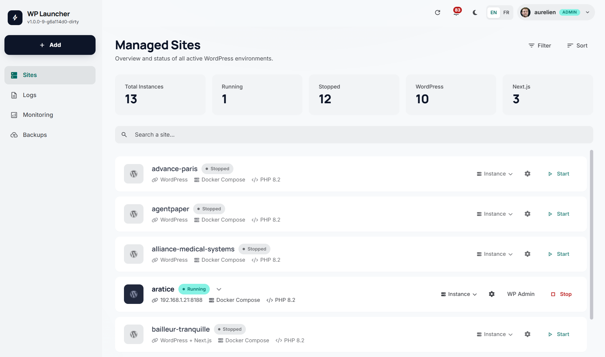

# WP Launcher

[](https://github.com/Zakaru-Studio/wp-launcher)
[](LICENSE)
[](https://www.python.org/downloads/)
[]()
[]()

**An open source project by [Zakaru Studio](https://github.com/Zakaru-Studio).**



> ⚠️ **Local development tool.** WP Launcher ships with intentionally weak
> default credentials (`admin/admin`, `rootpassword`) and requires `sudo`
> NOPASSWD for WordPress file permissions. **Do not expose it on the public
> internet.** See [Security](#security) for the full list of caveats.

A web application to create, manage, and maintain WordPress (and Next.js) projects via Docker containers.

Accessible through a real-time web interface on port 5000 with WebSocket support.

## Features

- **One-click WordPress project creation** with Docker
- **Multi-PHP support** — per-project PHP 7.4 / 8.3 / 8.4 / 8.5, swappable
  from the UI (auto-rebuilds the container)
- **Database import/export** (SQL, .sql.gz, .zip) streamed via stdin with
  byte-level progress, auto memory-bump to avoid OOM on large dumps, and
  a pre-import backup rotated in `logs/db-backups/`
- **Remote deployments** (`/deployments`) — register staging/production
  servers, pin SSH host fingerprints, ship via `git fetch && git reset
  --hard`, live log stream in the UI
- **Project cloning** and snapshots/restore
- **WordPress permissions management** (Docker-compatible)
- **WP-CLI integration** from the web UI
- **Container monitoring** and resource usage
- **Next.js support** with MongoDB or MySQL
- **WordPress debug mode** toggle (wp-config.php)
- **Real-time updates** via WebSocket — notifications popover, live
  deployment / import progress
- **Multi-developer instances** with Git integration
- **i18n** — English and French (browser locale auto-detected)

## Prerequisites

- **Python 3.10+**
- **Docker** and **Docker Compose**
- **sudo** access (for WordPress file permissions)
- Ubuntu/Debian recommended

## Quick Install

```bash
git clone https://github.com/Zakaru-Studio/wp-launcher.git
cd wp-launcher
chmod +x install.sh
./install.sh
```

The install script handles everything: prerequisites check, Python virtualenv, dependencies, data directories, symlinks, `.env` generation, and optional systemd service setup.

## Manual Install

```bash
# 1. Clone
git clone https://github.com/Zakaru-Studio/wp-launcher.git
cd wp-launcher

# 2. Python environment
python3 -m venv venv
source venv/bin/activate
pip install -r requirements.txt

# 3. Create data directories (git-ignored)
mkdir -p projets containers uploads data/avatars logs snapshots

# 4. Create symlinks
ln -s "$(pwd)/projets" app/utils/projets
ln -s app/utils/containers containers

# 5. Configure
cp .env.example .env
# Edit .env with your local IP and preferences

# 6. Run
python3 run.py
```

## Usage

```bash
# Manual start
source venv/bin/activate
python3 run.py

# Via systemd (if installed)
sudo systemctl start wp-launcher
sudo journalctl -u wp-launcher -f
```

The web interface is available at `http://<YOUR_IP>:5000`.

## PHP versions

Each WordPress project picks its PHP version from the `Configuration PHP`
panel. Supported versions are defined in a single source of truth:
[`app/config/php_versions.py`](app/config/php_versions.py).

| Version | Ships as Docker image | Notes |
|---|---|---|
| 7.4 | `wp-launcher-wordpress:php7.4` | Legacy sites only |
| 8.3 | `wp-launcher-wordpress:php8.3` | |
| 8.4 | `wp-launcher-wordpress:php8.4` | **Default** for new sites |
| 8.5 | `wp-launcher-wordpress:php8.5` | Latest |

Build all images at install time (takes ~15 minutes on first run):

```bash
./scripts/build_wordpress_images.sh
# Or just one version:
./scripts/build_wordpress_images.sh 8.5
```

To add a new version, drop a `docker-template/wordpress/Dockerfile.phpX.Y`
file, append `'X.Y'` to `SUPPORTED_PHP_VERSIONS`, and re-run the build
script. The dropdown, validator and rebuild path all derive from the same
list — no other edits needed.

Sites already pinned on a retired version (e.g. 8.2) keep that option
visible in their dropdown until migrated, so an upgrade is never forced.

## Remote deployments

The `/deployments` page lets admins ship a project to a staging or
production server over SSH:

1. Register a server — label, hostname, SSH user, private key (stored
   Fernet-encrypted at rest, derived from `SECRET_KEY` via HKDF). Click
   **Test connection** to pin the host fingerprint.
2. Optional: set a custom deploy path per (project × server) pair; the
   default is `<server.deploy_base_path>/<project_name>`.
3. Click **Deploy**, pick project + server + branch. The remote runs
   `git fetch --prune origin && git reset --hard origin/<branch> &&
   git rev-parse HEAD`. Stdout/stderr stream live into the modal via
   Socket.IO.

Permission model: admins can deploy anything; a developer can deploy a
project only if they own an active dev-instance on it. Every `git`,
`deploy-path`, and `run` endpoint gates on this check.

Repos are expected to be cloned on the target server already (v1
deliberately does not bootstrap clones). If the project needs
composer/npm/wp-cli steps, add a `deploy.sh` at the repo root — it is
picked up automatically after the `git reset`.

## Configuration

All settings are in the `.env` file (not tracked by git):

```env
APP_HOST=192.168.1.100       # Your server's local IP
APP_PORT=5000                # Web interface port
SECRET_KEY=...               # Flask secret (auto-generated by install.sh)

# WordPress defaults for new projects
WP_ADMIN_USER=admin
WP_ADMIN_PASSWORD=admin
WP_ADMIN_EMAIL=admin@example.com
WP_LOCALE=en_US
```

See [.env.example](.env.example) for all available options.

## Architecture

```
wp-launcher/
├── run.py                     # Entry point
├── install.sh                 # Setup script
├── requirements.txt           # Python dependencies
├── wp-launcher.service        # systemd service template
├── docker-template/           # Docker Compose templates
│
├── app/                       # Main package
│   ├── __init__.py            # Flask factory
│   ├── config/                # Configuration
│   │   ├── docker_config.py   # Docker / paths / network
│   │   └── php_versions.py    # Single source of truth for PHP support
│   ├── models/                # Models (Project, User, DevInstance, Server)
│   ├── routes/                # Flask routes (API + pages)
│   │   ├── deployments.py     # /deployments — servers CRUD, run, log
│   │   ├── database.py        # DB import / export
│   │   └── ...
│   ├── services/              # Business logic
│   │   ├── deployment_service.py  # SSH-based deploy worker
│   │   ├── fast_import_service.py # Streaming SQL import
│   │   ├── server_service.py      # Remote server inventory
│   │   ├── ssh_service.py         # paramiko + Fernet-encrypted keys
│   │   └── ...
│   ├── middleware/            # Auth middleware
│   ├── utils/                 # Utilities
│   ├── static/                # CSS, JS, images
│   ├── translations/          # Flask-Babel catalogs (en, fr)
│   └── templates/             # Jinja2 templates
│
├── scripts/                   # Maintenance scripts
│   └── build_wordpress_images.sh  # Build all PHP-versioned images
│
├── projets/                   # WordPress project files (git-ignored)
├── containers/                # Docker configs per project (git-ignored)
├── data/                      # SQLite databases (git-ignored)
│   └── deployments.db         # Servers inventory + deployment history
├── logs/                      # Application logs (git-ignored)
│   ├── db-backups/            # Pre-import DB backups (rotation 5)
│   └── deployments/           # Per-deployment log files (rotation 500)
└── snapshots/                 # Project snapshots (git-ignored)
```

## Security

**This tool is designed for local development environments only.**

### Known defaults (intentionally weak for dev convenience)

| Item | Default |
|---|---|
| WordPress admin | `admin` / `admin` |
| MySQL root | `rootpassword` |
| MySQL wp user | `wordpress` / `wordpress` |
| `SESSION_COOKIE_SECURE` | `false` (so HTTP works on `192.168.x.x`) |
| Flask `SECRET_KEY` | auto-generated by `install.sh`, **change for any shared deployment** |

### Required sudo rules

The app runs `sudo chown`, `sudo chmod`, `sudo find` and `sudo setfacl` on
WordPress bind-mounts (because Apache inside the container runs as
`www-data` UID 33 but files live on the host). `install.sh` configures the
NOPASSWD rules. Review them before use.

### Before any non-local deployment

- [ ] Strong `SECRET_KEY` (≥ 32 random bytes)
- [ ] `SESSION_COOKIE_SECURE=true` exported
- [ ] All default credentials rotated
- [ ] Access gated behind VPN / SSH tunnel / reverse proxy with auth
- [ ] Review the hardening checklist in [SECURITY.md](SECURITY.md)

### Reporting vulnerabilities

Do not open public issues for security problems. See
[SECURITY.md](SECURITY.md) for the private reporting channels.

## Contributing

See [CONTRIBUTING.md](CONTRIBUTING.md) and the
[Code of Conduct](CODE_OF_CONDUCT.md).

## License

[MIT](LICENSE)
